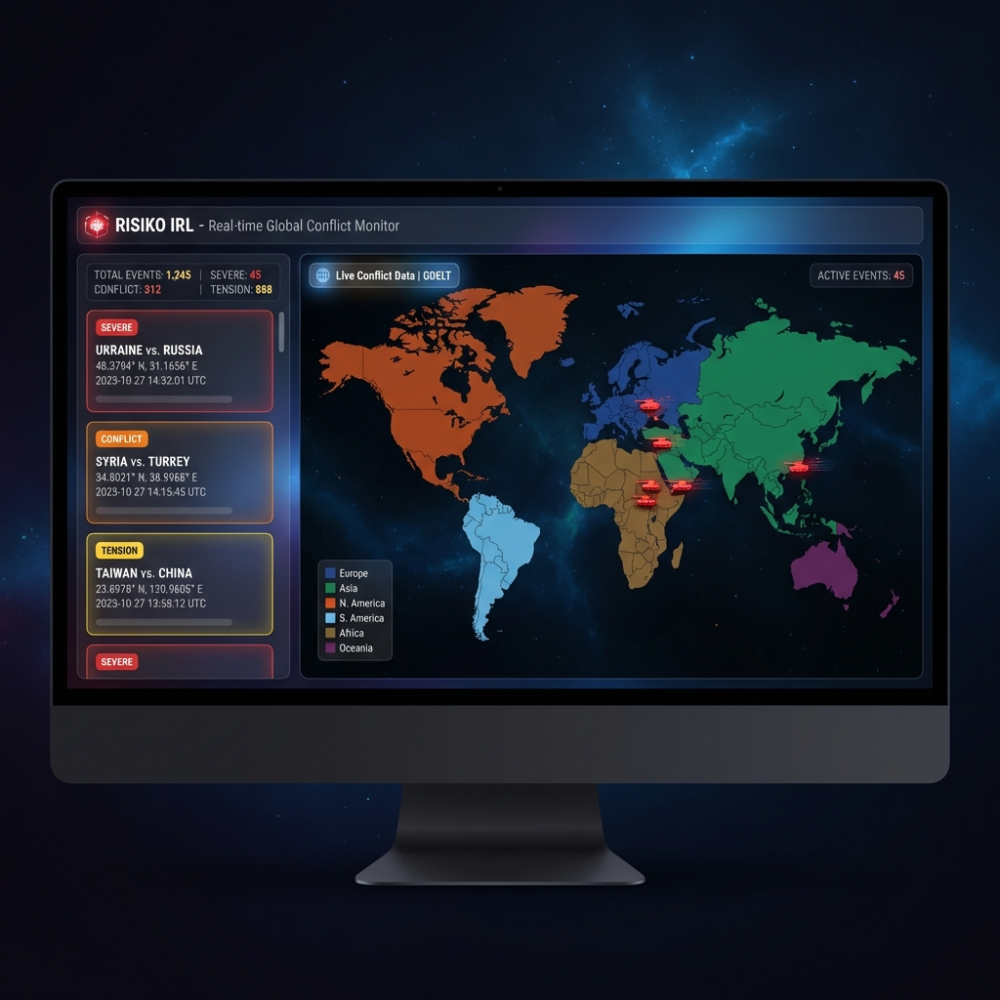
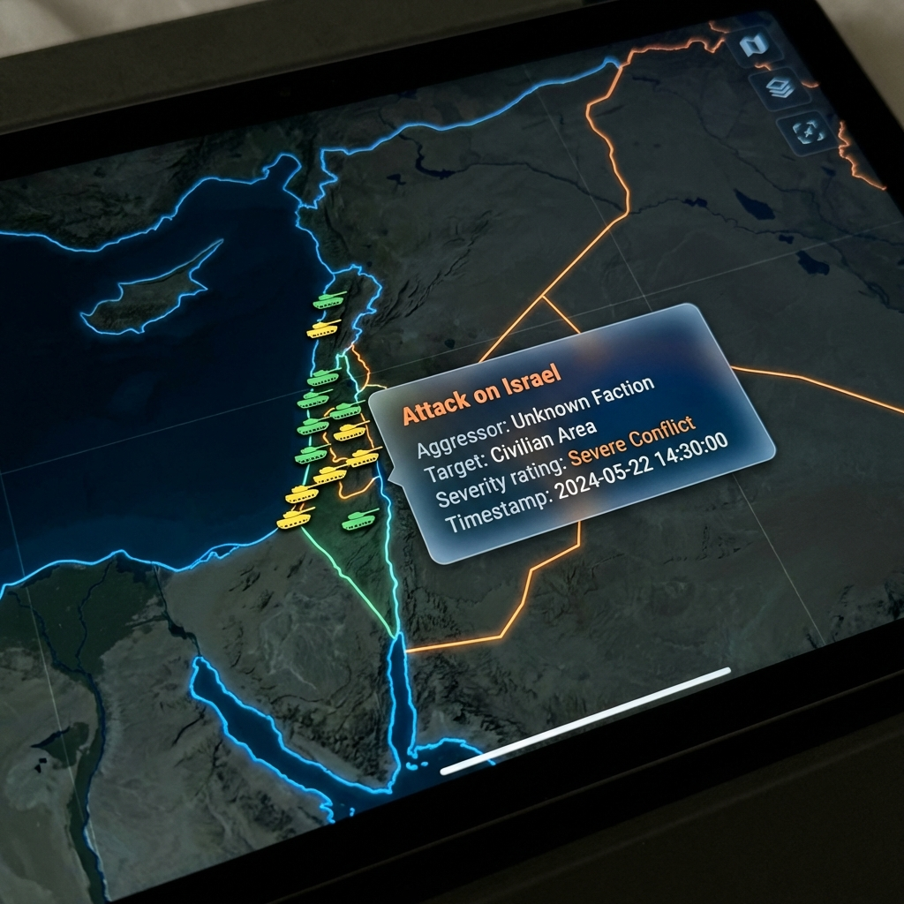
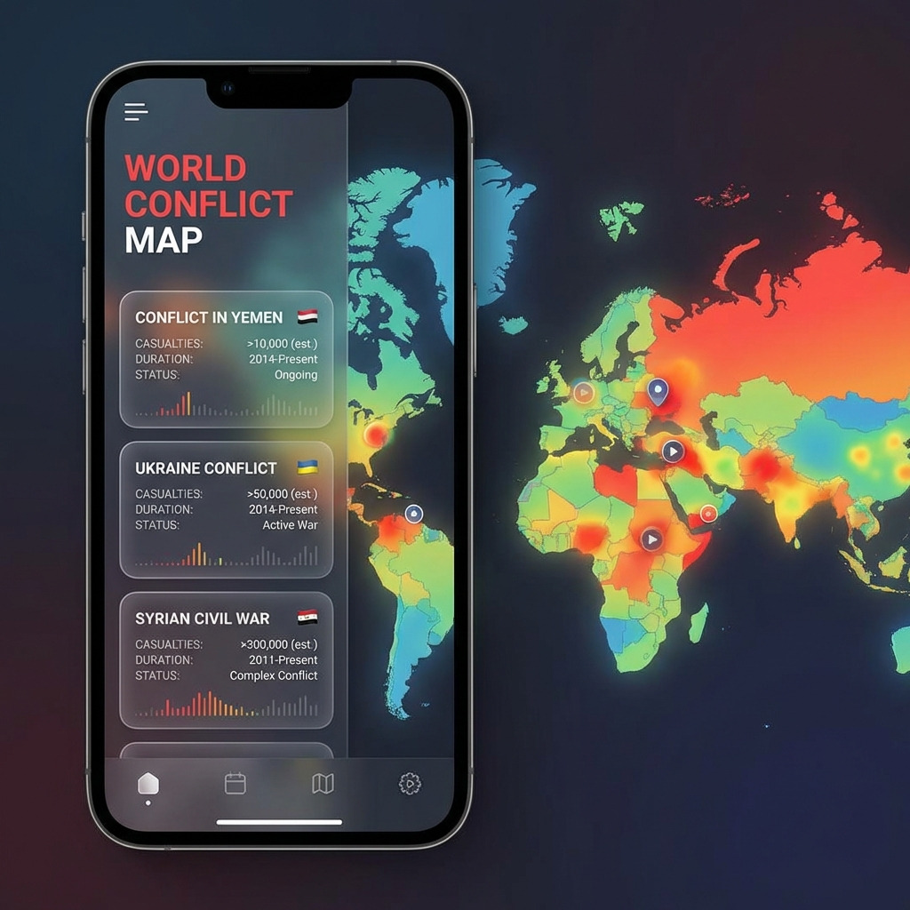

<div align="center">

# 🎯 WORLD CONFLICT MAP

### Real-Time Global Conflict Monitor

[](https://nextjs.org/)
[](https://react.dev/)
[](https://www.typescriptlang.org/)
[](https://tailwindcss.com/)
[](LICENSE)

[Live Demo](#-Overview) • [Features](#-features) • [Installation](#-installation) • [Tech Stack](#-tech-stack) • [API](#-api)

</div>

---

## 📸 Screenshots

<div align="center">

### Main Dashboard


*Interactive world map with distinct continental coloring and real-time conflict feed*

### Conflict Details


*Detail view showing incident specifics, location data, and context*

### Mobile Experience


*Professional mobile interface with accessible navigation and responsive layouts*

</div>

---

## 🌟 Overview

🔴 **LIVE DEMO:** [world-conflict-map.vercel.app](https://world-conflict-map.vercel.app)

**WORLD CONFLICT MAP** is a web-based dashboard designed to visualize global geopolitical events and conflicts in real-time. By leveraging data from the [GDELT Project](https://www.gdeltproject.org/), the application provides an accessible interface to monitor international developments, offering a clear graphical representation of active conflict zones.

The project visualizes complex global data through high-contrast, region-based color coding to facilitate rapid understanding of geopolitical dynamics.

### 🌍 Regional Visualization

Data is organized visually by continent, using a distinct color palette to easily distinguish geopolitical regions:

| Continent | Visualization |
|------------|--------|
| 🔵 Europe | Blue |
| 🟢 Asia | Green |
| 🟠 North America | Orange |
| 🔷 South America | Light Blue |
| 🟤 Africa | Brown |
| 🟣 Oceania | Purple |

---

## ✨ Features

### 🗺️ Interactive Data Map
- **Continental Color Coding**: distinct color schemes for immediate regional identification.
- **Smart Zoom & Navigation**: Smooth controls for exploring global hot-spots.
- **Dynamic highlighting**: Active zones are visually emphasized to draw attention to developing situations.

### 📱 Responsive Design
- **Mobile-First Interface**: Optimized layout for smartphones with a collapsible drawer system.
- **Touch-Friendly Controls**: Accessible interface for touch devices.

### 📊 Data & Insights
- **Conflict Monitoring**: Categorization of events (Armed Conflict, Civil Unrest, Cyber security).
- **Casualty Estimates**: Integrates available data on total estimated human impact for major ongoing conflicts.
- **Directional Markers**: Visual indicators showing the directional flow of events where applicable.
- **Contextual Information**: Detailed popups providing source links, intensity levels, and actors involved.

### 📡 Real-Time Intelligence
- **Live Feed System**: Chronological list of events updated frequently.
- **Robust API Integration**: Handles large datasets and API constraints efficiently.
- **Source Verification**: Direct links to original news sources for independent verification.

---

## 🚀 Installation

### Prerequisites

- **Node.js** 18.0 or higher
- **npm** or preferred package manager

### Quick Start

```bash
# 1. Clone the repository
git clone https://github.com/yourusername/world-conflict-map.git

# 2. Enter directory
cd world-conflict-map

# 3. Install dependencies
npm install --legacy-peer-deps

# 4. Start development server
npm run dev
```

Open [http://localhost:3000](http://localhost:3000) in your browser.

---

## 🛠️ Tech Stack

### Core Framework
- **[Next.js 16](https://nextjs.org/)** - Modern App Router architecture
- **[React 19](https://react.dev/)** - Component library
- **[TypeScript 5](https://www.typescriptlang.org/)** - Type-safe development

### Styling & UI
- **[Tailwind CSS 4](https://tailwindcss.com/)** - Utility-first styling
- **[Framer Motion](https://www.framer.com/motion/)** - Interface animations
- **[Lucide React](https://lucide.dev/)** - Icon system

### Data Visualization
- **[React Simple Maps](https://www.react-simple-maps.io/)** - Vector map rendering
- **[D3 Scale](https://d3js.org/)** - Mathematical scaling for data viz

---

## 📡 Data Architecture

### GDELT Integration

The application processes data from the **Global Database of Events, Language, and Tone (GDELT)**, specifically utilizing V2 endpoints to retrieve real-time event logs.

#### Data Processing Pipeline
1. **Fetch**: Retrive raw event logs from GDELT API.
2. **Contextualize**: Cross-reference with known conflict data (e.g., historical casualty estimates).
3. **Parse**: Extract actor names, locations, and event types using natural language processing heuristics.
4. **Display**: Render on the frontend with appropriate visual weight and categorization.

**Data Example:**
```json
[
  {
    "id": "evt-1-1705600000000",
    "source": "GDELT Network",
    "eventType": "conflict",
    "location": { "lat": 48.3794, "lon": 31.1656 },
    "actors": { "primary": "Russia", "target": "Ukraine" },
    "intensity": "High",
    "timestamp": "2025-01-18T10:30:00Z"
  }
]
```

---

## 📁 Project Structure

```
world-conflict-map/
├── 📂 public/          # Static assets
├── 📂 src/
│   ├── 📂 app/         # Next.js App Router pages & API
│   ├── 📂 components/  # Reusable UI components
│   └── 📂 lib/         # Utilities and API clients
├── package.json
└── README.md
```

---

<div align="center">

**WORLD CONFLICT MAP**

*Diego Scirocco*

</div>
